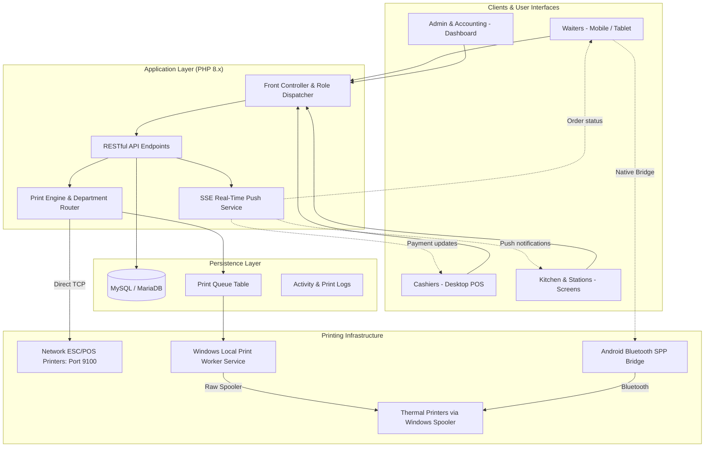

# Hotel Saba Restaurant Management System

A comprehensive, production-grade Restaurant Management and Point of Sale (POS) system engineered for Hotel Saba to streamline multi-station dining operations, real-time order lifecycle tracking, role-based staff workflows, multi-department thermal printing, inventory management, and financial analytics.

<p align="center">
  
</p>

---

## Overview

The **Hotel Saba Restaurant Management System** is a dedicated enterprise hospitality solution tailored to the operational requirements of Hotel Saba. It integrates front-of-house table service, kitchen preparation stations, cashier checkout desks, inventory warehousing, and administrative reporting into a unified, responsive platform.

Powered by a lightweight PHP backend, MySQL/MariaDB relational database, and native JavaScript with Server-Sent Events (SSE), the system guarantees instant bi-directional updates between dining areas, kitchen stations, cashiers, and administration without the latency or overhead of complex external runtimes.

---

## Features

### POS (Point of Sale)
- **Fast-Paced Cashier Interface**: Optimized for high throughput with table-based and walk-in order management.
- **Payment Processing**: Multi-channel payment settlement supporting Cash, Card, Room Charge (Hotel Guests), and Customer Digital Wallets.
- **Discounts & Surcharges**: Configurable discount rules, tax rates, and service charges.
- **Refunds & Adjustments**: Safe partial or full refund tracking with original and adjusted receipt calculations.
- **Shift & Settlement Management**: Automated shift cutoff locks, daily cashier drawer reconciliation, and end-of-shift summaries.

### Orders
- **Full Order Lifecycle**: Seamless progression across `pending` &rarr; `sent_to_cashier` &rarr; `in_progress` &rarr; `ready` &rarr; `delivered` / `paid` / `cancelled`.
- **Append Items to Active Orders**: Real-time addition of extra items to open orders with distinct tracking for previously printed vs. new items.
- **Item-Level Preparation Status**: Kitchen and beverage stations can accept, start, or reject specific order lines with automated price readjustment.
- **Preparation Time Tracking**: Benchmarks order prep duration per item to identify kitchen bottlenecks.

### Restaurant Operations
- **Floor & Table Management**: Interactive table assignment and dining room status views.
- **Ticket Sales Module**: Dedicated ticketing engine for special hotel events and buffet passes (`ticket_types` & `ticket_sales`).
- **Real-Time Synchronization (SSE)**: Built-in Server-Sent Events engine pushing immediate visual and audible notifications across all stations.
- **Closed Shift Security**: Enforces shift cutoff times with audit-logged administrative override permissions.

### Staff & Permissions
- **Granular Access Control**: Role-based base privileges combined with fine-grained custom permission flags (`permissions` JSON).
- **Category-Restricted Station Views**: Custom station assignment defining exactly which food/beverage categories each kitchen user can access (`user_category_permissions`).
- **Activity Audit Trail**: Comprehensive logging of sensitive administrative operations (order deletions, shift bypasses, payment changes) with advanced multi-criteria filtering.

### Inventory & Warehousing
- **Ingredient & Raw Material Catalog**: Tracking stock units, minimum thresholds, and unit costs.
- **Purchase Orders & Receptions**: Logging ingredient purchases and replenishments with supplier and coordinator notes.
- **Internal Requisition Workflow**: Multi-tier request pipeline (`inv_requests`) connecting dining stations, coordinators, and warehouse managers.
- **Recipe & Stock Linkage**: Tracking menu items to ingredient deductions and consumption logs.

### Multi-Department Thermal Printing
- **Intelligent Department Routing**: Automatic dispatch of items based on Category &rarr; Department &rarr; Designated Printer (e.g., Grills &rarr; Hot Kitchen, Drinks &rarr; Juice Bar).
- **Dual Hardware Support**:
  - **Network TCP/IP Printers**: Raw ESC/POS byte streaming via TCP sockets (`port 9100`).
  - **Local USB / Windows Printers**: Direct Windows Print Spooler P/Invoke via background service.
- **Mobile Bluetooth Bridge (`js/native-bridge.js`)**: Mobile/tablet waiter integration supporting Android WebView / Flutter channels (`AndroidPrint`, `PrinterBridge`) and Android Intent fallback (RawBT).
- **Asynchronous Print Queue**: Database-backed queue (`print_queue`) with atomic job claiming (`SELECT FOR UPDATE`), pre-rendered ESC/POS binary buffers, and idempotency protection (`request_id`).
- **Local Print Worker Service**: Standalone background workers (`local_print_worker.php`, `start_print_service.bat`, `start_print_service.ps1`) for polling cloud servers and printing to local hardware.

### Reports & Business Intelligence
- **Financial Daily Summaries**: Breakdown of sales, payment methods, discounts, and net revenues.
- **Sales Statistics & Analytics**: Top-selling items, category performance, and item prep time distributions with visual Chart.js graphs.
- **Room Sales Audit**: Dedicated hotel room charge reconciliation for front-desk audit.
- **Excel & Print Export**: Instant generation of structured accounting spreadsheets and thermal summaries.

---

## User Roles

| Role | System Identifier | Key Responsibilities |
| :--- | :--- | :--- |
| **System Administrator** | `admin` | Full system governance, menu engineering, printer routing, user permissions, audit logs, and settings. |
| **Waiter / Server** | `waiter` | Table order creation, extra item additions, table status tracking, and floor delivery confirmation. |
| **Cashier** | `cashier` | Order verification, invoice settlement, payment collection, receipt printing, and shift reconciliation. |
| **Head Chef / Kitchen** | `chef` / `kitchen` | Food preparation queue, preparation time updates, item completion signaling. |
| **Juice Bar Operator** | `juice_bar` | Cold drinks and beverage station preparation. |
| **Financial Accountant** | `accountant` | Review of financial reports, cashier settlements, sales analytics, and ledger verification. |
| **Warehouse Manager** | `warehouse_manager` | Managing inventory stocks, approving requisition requests, and receiving purchase shipments. |
| **Inventory Monitor** | `inventory_monitor` | Monitoring minimum stock thresholds, inventory transactions, and consumption logs. |
| **Request Coordinator** | `request_coordinator` | Reviewing and routing internal stock requisitions between stations and warehouse. |
| **Hotel Receptionist** | `receptionist` | Monitoring room charge dining balances and room sales views. |

---

## System Architecture



---

## Technology Stack

- **Backend**: PHP 8.x (Native PDO, structured modular routing, strict collation & session security).
- **Database**: MySQL / MariaDB (InnoDB, `utf8mb4_unicode_ci`, relational foreign key constraints, atomic transactions).
- **Real-Time Engine**: Server-Sent Events (SSE) via lightweight database-backed event queue (`sse_events`).
- **Frontend**: HTML5, Vanilla JavaScript (ES6+ async/await, Fetch API, EventSource), Modern CSS3 (Custom Properties design system, CSS Grid/Flexbox).
- **Libraries & UI**: FontAwesome 6 (Icons), Google Fonts (Cairo / Inter), Chart.js (Data visualizations).
- **Hardware Integration**: ESC/POS binary command synthesis, Windows Print Spooler P/Invoke via PowerShell, raw TCP sockets via `fsockopen`.
- **Web Server**: Apache with `.htaccess` rewrite rules and protected directory configurations (tested on XAMPP and Linux hosting).

---

## Directory Structure

```text
├── admin/                  # Administrative control panel & management modules
│   ├── _layout.php         # Admin base layout, sidebar, and dynamic navigation
│   ├── activity_log.php    # Activity monitoring with multi-criteria search
│   ├── departments.php     # Department printer assignment
│   ├── financial_revenues.php # Financial revenue tracking
│   ├── index.php           # Admin dashboard and analytics overview
│   ├── inventory.php       # Raw material stock and purchase entries
│   ├── items.php           # Menu item catalog and pricing
│   ├── printers.php        # Hardware printer network & spooler setup
│   ├── reports.php         # Sales and financial reports
│   └── users.php           # Staff accounts and granular permissions
├── api/                    # RESTful endpoints & real-time handlers
│   ├── activity.php        # Audit log querying and filtering
│   ├── auth.php            # Session validation and login API
│   ├── orders.php          # Core order lifecycle and transaction processing
│   ├── print_engine.php    # Department routing and ESC/POS generator
│   ├── print_queue.php     # Queue worker claim and status endpoints
│   ├── reports.php         # Aggregated financial analytics engine
│   └── sse.php             # Server-Sent Events real-time broadcast stream
├── assets/                 # Frontend assets (CSS styles, global scripts)
│   ├── css/style.css       # Unified design system & responsive UI rules
│   └── js/app.js           # Core client utilities, modals, and toasts
├── cashier/                # Dedicated Cashier POS station
│   ├── _layout.php         # Cashier layout and navigation
│   ├── index.php           # Cashier order monitor and checkout console
│   └── reports.php         # Shift settlements and cashier summaries
├── config/                 # Configuration & environment setup
│   ├── db.php              # Database connector & environment loader
│   ├── db.example.php      # Sample configuration template
│   └── db.local.php        # Ignored local credentials override
├── database/               # Database schemas and initialization
│   ├── schema.sql          # Clean, complete database schema with seed data
│   └── restaurant_pos.sql  # Base schema reference
├── docs/                   # Documentation assets & guides
│   └── assets/saba-logo.png# Official Hotel Saba logo
├── images/                 # System branding and static imagery
├── js/                     # Hardware integration scripts
│   └── native-bridge.js    # Android / Bluetooth thermal printing bridge
├── station/                # Kitchen & Bar preparation station
│   ├── _layout.php         # Station layout and audio alerts
│   └── index.php           # Real-time prep ticket monitor
├── uploads/                # User-uploaded item images (.gitkeep protected)
├── waiter/                 # Waiter mobile-optimized POS
│   ├── _layout.php         # Waiter interface layout
│   ├── index.php           # Floor table and order creation view
│   └── orders.php          # Active orders and item add-on view
├── local_print_worker.php  # Windows local polling print worker
├── queue_worker.php        # CLI background worker for print queue
├── print_receipt.php       # Multi-language thermal receipt renderer
├── start_print_service.bat # Windows CMD persistent print service launcher
├── start_print_service.ps1 # Windows PowerShell print service launcher
└── index.php               # Root entry point and authenticated role router
```

---

## Installation & Setup

### Prerequisites
- **Web Server**: Apache (XAMPP for Windows or Apache2 on Linux).
- **PHP**: PHP 8.0 or higher with `pdo_mysql`, `curl`, and `mbstring` extensions enabled.
- **Database**: MySQL 5.7+ or MariaDB 10.4+.

### Step 1: Clone the Repository
```bash
git clone https://github.com/adnanalqham/hotel-saba-restaurant.git
cd hotel-saba-restaurant
```

### Step 2: Initialize Database
1. Open MySQL / MariaDB (e.g., via phpMyAdmin or MySQL CLI).
2. Create a fresh database:
   ```sql
   CREATE DATABASE `restaurant_pos` CHARACTER SET utf8mb4 COLLATE utf8mb4_unicode_ci;
   ```
3. Import the clean schema file:
   ```bash
   mysql -u root -p restaurant_pos < database/schema.sql
   ```

### Step 3: Configure Database Connection
By default, the application connects to local XAMPP (`127.0.0.1`, user `root`, no password).

To customize your connection, create `config/db.local.php` (this file is ignored by Git):
```php
<?php
define('DB_HOST', '127.0.0.1');
define('DB_USER', 'your_database_user');
define('DB_PASS', 'your_database_password');
define('DB_NAME', 'restaurant_pos');
```
Alternatively, set the following environment variables on your server: `DB_HOST`, `DB_USER`, `DB_PASS`, `DB_NAME`.

### Step 4: Access the Application
Point your browser to the local URL (e.g., `http://localhost/restaurant/`).

#### Default Administrative Credentials:
- **Username**: `admin`
- **Password**: `password`

*(Please change the default password immediately after initial login via Profile Settings).*

---

## Printing Setup & Worker Configuration

The system provides flexible printing topologies depending on the physical environment:

### 1. Network Thermal Printers (TCP/IP)
1. Go to **Admin Panel &rarr; Printers** (`admin/printers.php`).
2. Add the printer with its static IP address (e.g. `192.168.1.200`) and port `9100`.
3. In **Departments** (`admin/departments.php`), map the category to its designated printer.

### 2. Local USB / Windows Spooler Thermal Printers
For printers connected directly to Windows client PCs via USB:
1. Ensure the thermal printer driver is installed in Windows (e.g., named `POS-Kitchen` or `POS-Cashier`).
2. In **Admin Panel &rarr; Printers**, specify the **Windows Printer Name** exactly as displayed in Windows Devices & Printers.
3. Launch the automatic background print worker:
   - Double-click `start_print_service.bat` or run `start_print_service.ps1`.
   - The worker will monitor the database print queue and spool binary ESC/POS data directly to the local hardware.

### 3. Waiter Mobile Bluetooth Printing
- Waiters using Android tablets or smartphones connected to portable Bluetooth receipt printers can print tickets directly using the built-in `native-bridge.js`. The bridge interfaces with Android WebView native handlers or Android print apps (e.g., RawBT).

---

## License & Intellectual Property

Proprietary software developed for **Hotel Saba**. All rights reserved.
